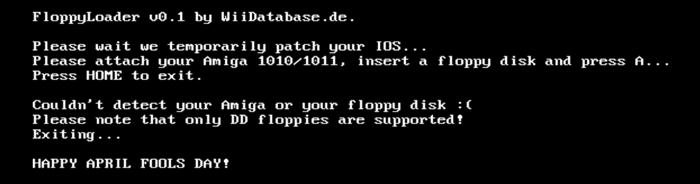

FloppyLoader
============
**NOTE:** This is an april fools joke and everything written here is a work of fiction. The application doesn't patch anything. Below you'll find a translation of our [original blogpost](https://wiidatabase.de/floppyloader-v0-1-wii-homebrews-von-diskette-laden/).

## FloppyLoader v0.1: Load Wii homebrews from a floppy drive

The ~~WiiDatabase~~ AmigaDatabase team presents an application for the Nintendo Wii which can load homebrews from a floppy disk!

Who isn't familiar with this: You don't have a USB stick at hand and the SD went down the drain again. Thank god there is still the good old floppy disk in the last drawer with some old, surely unimportant work documents from your parents. Finally there's a reason to overwrite them, because the cIOS have to be installed!

Fail0verflow presented "[lolserial](https://fail0verflow.com/media/30c3-slides/#/15/1)" at the 30c3 and we'll use this to connect our Amiga 1010/1011 to our Wii:

Of course you have to use a 23 pin D-Sub connector instead of the 9 pin connetor shown in the picture. We will release the circuit diagram soon.

When the floppy drive is attached, just copy the "boot.dol" of the homebrew you want to run to a Double Density floppy and start our FloppyLoader (e.g. through Wiiload). It patches the IOS temporarily and loads the boot.dol into the Wii's RAM, which means you can eject the floppy again. And this is the big advantage over Wiiload: Due to the way it works, every access to the SD card is redirected to the floppy disk and more data can be loaded from a second floppy. This is perfect for the e.g. ciosmaps.xml!

As you have read above sadly only DD floppies and Amiga 1010/1011 drives are supported. In the future we will support HD floppies, more devices and hopefully split DOLs!

We hope you enjoy our new homebrew!

## meta.xml description
With this application you can load DOLs from a floppy drive!

Currently only the Amiga 1010 and 1011 are supported. You must connect it via the sensor bar connector, then insert your floppy with a single file named "boot.dol" and let FloppyLoader do the rest!

* Press "A" to start
* Press "HOME" to exit

NOTE: This application temporarily patches your IOS so HW_AHBPROT must be disabled
(it is if your Homebrew Channel runs on the IOS 58).

It also works on the Wii U.

## What does it actually do?
It just prints text, says it didn't detect your Amiga and spits out an April Fools message.

